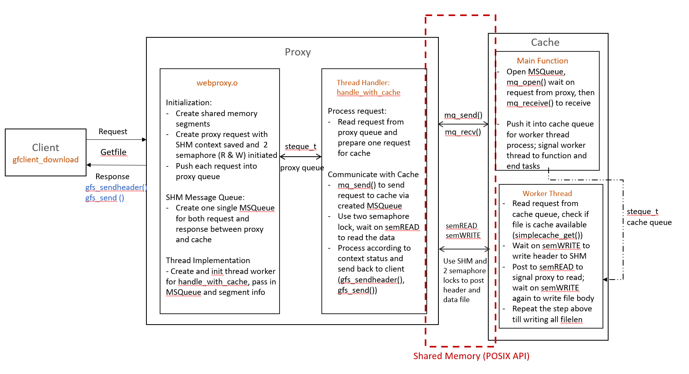

# Project 3 README file
In this file, I illustrate the implementation flow of each part in detail and use pictures as high-level design guidance. I also conclude the tests I tried and the project design trade-offs and struggles etc.

## Part I: Proxy Server with libcurl

Based on what we implemented in project 1, here we only need to change the previous `handle_with_file` callback function into  `handle_with_curl` function using `libcurl` interfaces to retrieve from the web. We need to design a proper structure to save the necessary information for the curl context and pass the server path into the callback function. The key for this part is to use the proper libcurl API functions to properly get the info, write the data, process them, and send it to the client using gfserver library.

## Part II: Proxy-Cache Shared-memory IPC

### A. Project design
For this part, we need to implement the proxy and cache respectively and construct their IPC through shared memory with POSIX API. The overall design is as follows.

The overall workflow consists of five main parts:

- Proxy receiving a request from the client

- Proxy passing the info to cache

- Cache receiving the request message (via shared memory with POSIX API) 

- Cache checking file and making the copy in share memory, using two (read/write) semaphore signaling

- Proxy sending out received data to the client

I started implementing those five parts in single-thread mode first and changed them into multi-thread modes afterward.

### B. Trade-offs
For this design, I made the following choices for code implementations.

#### 1. Single POSIX message queue for both request and response
Originally I implemented two POSIX message queues for (a) webproxy request for simplecached (b) simplecached response to webproxy. But this is not easily controlled for memory synchornization and yielded some semaphore lock problems. Thus, I changed to one single message queue and found it worked well with binary semaphores (`semREAD`, `semWRITE`). Furthermore, since there is only one message queue available to both proxy and cache, I set a global variable to save its name, segment size, and segment number info for convenience.

#### 2. Binary semaphores for Read/Write lock
I set up two separate semaphores to denote file read and write lock respectively. In this way, we can use  `sem_wait`, `sem_post` to avoid conflicted/illegal access for multiple memory operations and better synchronize the data.

#### 3. Set up `ContextShm_t` struct to save shared memory context
To save the necessary requested file info for each shared memory, I set up a struct `ContextShm_t` to save file name, file length, current saved data length, requested data status, etc. To adhere to the design of read/write synchronization for each memory segment, I saved the binary semaphores (`semREAD`, `semWRITE`) inside as well.

#### 4. Set up `ContextWebProxy_t` struct to save general segment info (seperate from `ContextShm_t`)
To add on the `ContextShm_t` struct design discussed above, I also set up a `ContextWebProxy_t` struct to save the common segment information, i.e. `nSegments`, `segsize` etc. Previously I included the information in the `ContextShm_t` struct as well, but it raised some failure When segment size is small. I noticed some file transfer uncomplete failure under the scenario that the designed `ContextShm_t` type variable might not fit in the shared memory. To reconcile this conflict, I separated the common segment info into a new struct `ContextWebProxy_t`, and only saved segment memory-specific info in `ContextShm_t`.

#### 5. Set up `threadInfo` struct to control thread life
To control the worker thread life in simplecached, I set up a struct `threadInfo` to save the thread and their flag for alive. The function of a thread is only allowed only when it is being flagged as enabled. In this way, we can easily control the functionality of the cache worker thread.

### C. Debug Solutions
Although the overall design is relatively straightforward, I still encountered lots of errors locally in implementation and spent hours and days trying to debug them. The following are typical mistakes and my solutions to tackle them.

#### 1. mq_open/mq_send/mq_receive failure
I encountered various issues with mq_send, mq_receive initially. What helped me is to use `strerror(errno)` and extra print logs to see the error info. The error came from the msg_size incorrect set (should be sizeof(request_type), the oflag (or permission mode) not correctly configured, etc.

#### 2. Client hang (the most frustrating one)
After my code initially worked for the single-thread mode, I encountered the client hang error in multithreaded mode (again :). I had a hard time troubleshooting them. It turned out to be a very tricky method thanks to a Piazza friend here https://piazza.com/class/ksj1dzntsni27l?cid=1360.

Previously I was also allocating a fixed memory for cache request variable (i.e. `MSQRequest_t g_request;`), but did not realize the enqueued address would point to newly received message if it coming before current data is popped. Thus, the proxy thread might be waiting for the response of this message forever. To tackle it, we need to initialize a pointer to the request variable (i.e. `MSQRequest_t *g_request;`) so that the pointer can change dynamically without leaving data/memory unvisited.

#### 3. Memory leakage in general
When I created webproxy_request using dynamic allocation (`malloc`), although I implemented memory-free in the final clean-up, there are still some memory leakage errors. It turns out I need to free up memory for those early exits or errored scenarios as well. Also, I made a mistake in not calling the POSIX shared memory API in the correct order, i.e. from `shm_open` -> `mmap` -> `shm_close` -> `shm_unlink`, thus leading to memory leakage as well. Then I re-visited their usage from lectures and Linux manual page, and made sure to implement in the order of "creation, attach, detach and destroy".

### D. Testing
Similar to project 1, here I tried to change different paths in `workload.txt` and using existing `gfclient_download, gfclient_measure` to test the code. I focused on the following aspects:
- Modifying different file paths (including valid and invalid, cached and non-cached), to test the proper handling of cache file check and sending correct response
- Starting webproxy and cache in a different order, all working successfully and getting proper cleanup (no memory leakage)
- Changing the thread number, segment number, and segment size, etc. to verify the robustness of share memory implementation

### E. References
[1] libcurl's "easy" C interface https://curl.se/libcurl/c/

[2] POSIX Shared Memory API: https://man7.org/linux/man-pages/man7/shm_overview.7.html

[3] Reader/Writer Semaphore: https://0xax.gitbooks.io/linux-insides/content/SyncPrim/linux-sync-5.html

[4] Google Sanitizer Wiki: https://github.com/google/sanitizers/wiki/AddressSanitizer
